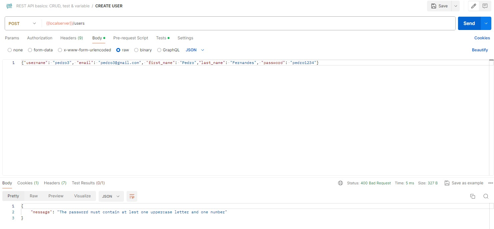

# Atividade de Conclusão de TypeScript - Alpha EdTech

***

### Proposta
Desenvolver uma API em TypeScript voltada para empresas que precisam gerenciar suas equipes e funcionários.

***

### Funcionalidade
A API permite com que você crie e gerencie equipes e funcionários respeitando as regras de negócio e permissões. Por exemplo, algumas ações estão disponíveis apenas para administradores, como listar todos os usuários, criar uma nova equipe entre outros. Já atualizar um perfil pode ser feito apenas por este próprio usuário.

Também trabalhamos com uma autenticação via JWT para login e logout.

Abaixo haverá uma lista das rotas e suas respectivas funcionalidades da API:
- GET “/users/me” - Ver seu próprio usuário (Todos). Retorna a entidade Usuario.
- GET “/users/” - Ver todos os usuários (Administrador). Retorna uma lista da
entidade Usuario.
- GET “/users/:user_id” - Ver determinado usuário (Administrador, Líder da equipe,
Líder das demais equipes somente se “user_id” designar um líder). Retorna a entidade
Usuario.
- GET “/teams/” - Ver todas as equipes (Administrador, Líder de qualquer equipe).
Retorna uma lista da entidade Equipe.
- GET “/teams/:team_id” - Ver determinada equipe (Administrador, Líder de qualquer
equipe, Funcionário da equipe). Retorna a entidade Equipe.
- GET “/teams/:team_id/members” – Ver os membros de determinada equipe
(Administrador, Líder da equipe, Funcionário da equipe). Retorna uma lista da entidade
Usuario.
- POST “/login” – Se autenticar, ganhando uma sessão (Todos e não autenticado).
Retorna um token de acesso.
- POST “/users/” - Criar um novo usuário (Todos e não autenticado). Retorna a
entidade Usuario recém-criada.
- POST “/teams/” - Criar uma nova equipe (Administrador). Retorna a entidade
Equipe recém-criada
- POST “/teams/:team_id/member/:user_id” - Adicionar membro na equipe
(Administrador, Líder da equipe). Retorna a entidade Usuario.
- PATCH “/users/:user_id” - Atualizar usuário (Somente o próprio usuário). Retorna
a entidade Usuario.
- PATCH “/teams/:team_id” - Atualizar equipe (Administrador, Líder da equipe).
Retorna a entidade Equipe.
- DELETE “/teams/:team_id/member/:user_id” - Retirar membro da equipe
(Administrador, Líder da equipe). Retorna a entidade Usuario.
- DELETE “/users/:user_id” - Deletar usuário (Administrador). Retorna a entidade
Usuario deletada.
- DELETE “/teams/:team_id” - Deletar equipe (Administrador). Retorna a entidade
equipe deletada.
- DELETE “/logout” - Deletar sessão (Todos e autenticado).

As rotas, ao necessário, pedem validações para se adequarem as regras de negócio. Veja um exemplo de quando tentamos criar um usuário com uma senha que não faz jus às regras, como possuir menos de 8 caracteres ou sem uma letra maiúscula.

Perceba que as mensagens são personalizadas conforme o erro ocorrido, veja agora um caso de sucesso:

***

### Como utilizar a aplicação
Baixe as pastas e utilize o comando ``npm i`` no terminal para instalar todas as bibliotecas que o projeto solicita, localizadas no arquivo ``package.json``. Após isso, crie um arquivo chamado ``.env`` para colocar algumas configurações sensíveis que não estão disponíveis publicamente: porta, configurações do banco de dados e a chave de acesso para o JWT.

Por fim, construa o projeto com o comando ``npm run build`` e abra o servidor express com ``npm start``.

##### Banco de Dados
Certifique-se de criar um banco de dados que possuem as tabelas e atributos necessários para a comunicação com a API.

Este arquivo contém todos os comandos SQL necessários para criar as tabelas e atributos necessários. Você pode executar esses comandos em seu banco de dados para configurá-lo adequadamente.
[Baixar arquivo SQL](./schema.sql)

Lembre de configurar os seguintes dados: host, porta, database, user e password. Eles precisam ser condizentes com as configurações que foram inseridas no ``.env``.

***

### Contribuição

Este projeto foi desenvolvido pelos seguintes contribuintes:
- [Anita Yumi Kawasaki](https://github.com/aanitakawasaki)
- [Kaliane da Silva Marques](https://github.com/kalianemarques)
- [Leonardo Mori de Lima](https://github.com/LeoMoriLima)
- [Pedro Lucas Fernandes Ferreira](https://github.com/PedroLucasFernandes)